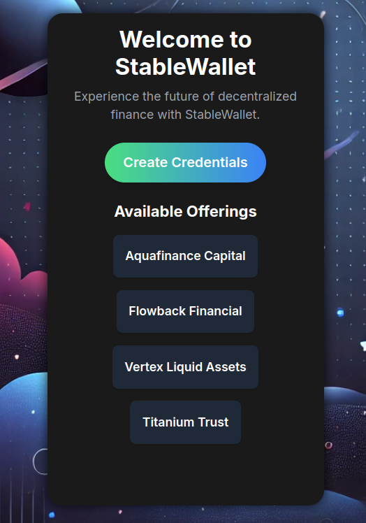
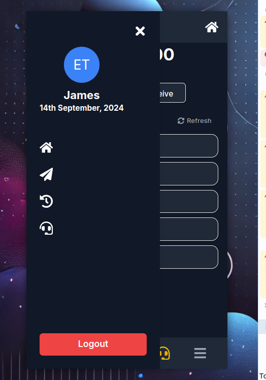
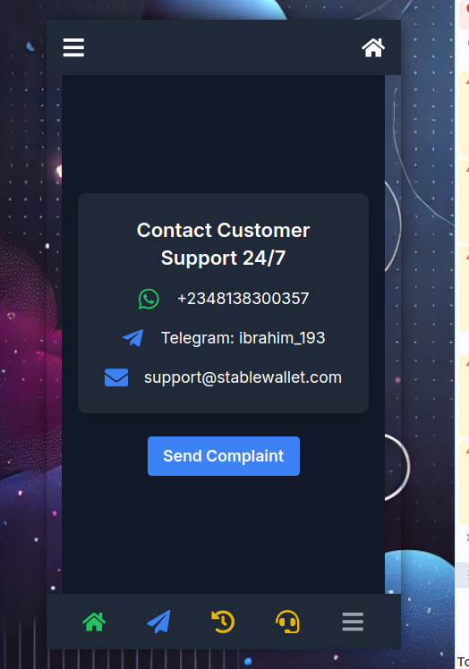
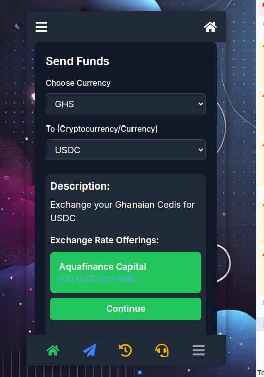
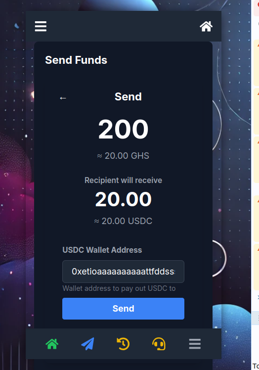
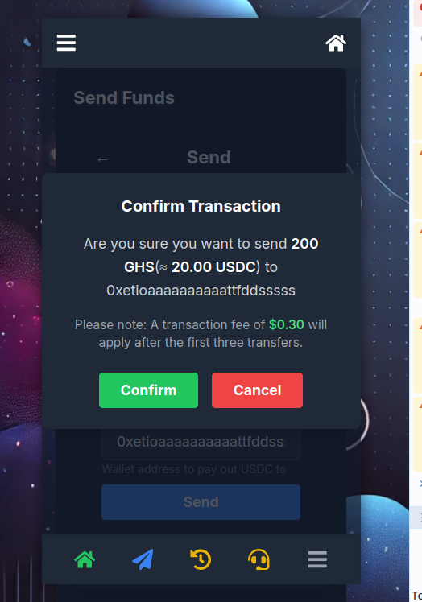
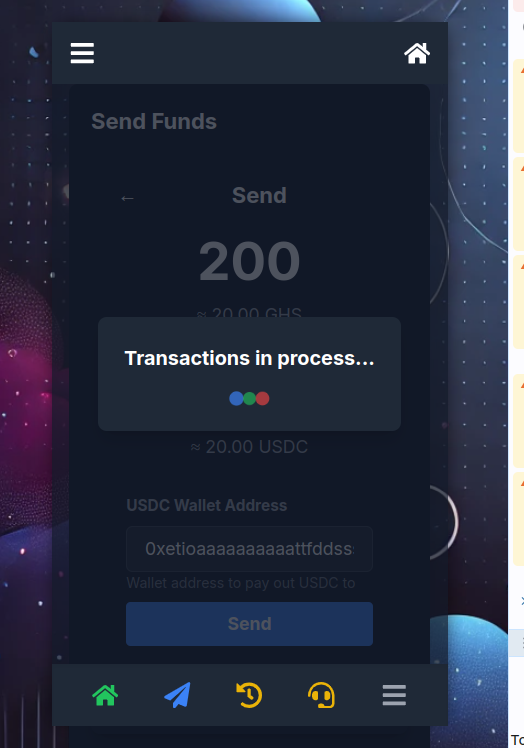
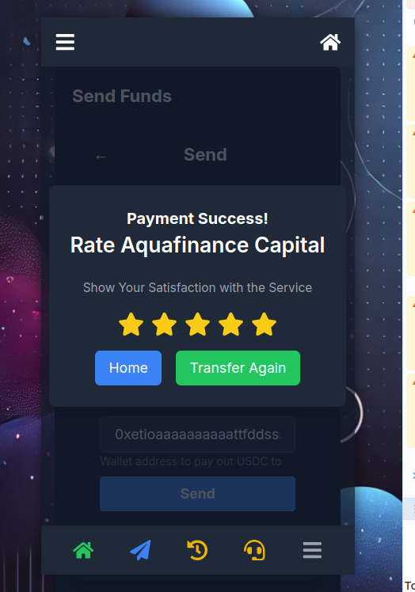

# Guide to Using StableWallet

This guide will walk you through how to use the StableWallet application step-by-step. By the end of this guide, you will be familiar with sending and receiving funds, rating service providers (PFIs), and navigating the application.

## 1. Welcome Screen

When you first open the StableWallet application, you'll be greeted with the welcome screen.

Here, you can create credentials by clicking on the **Create Credentials** button. Below, you will find a list of available offerings from different financial providers.

## 2. Sidebar Navigation

The application provides a sidebar that you can open by clicking the hamburger menu at the top left.

The sidebar shows your profile with initials, the current date, and links to key sections of the app like Home, Send, History, and Support. You can log out using the **Logout** button at the bottom.

## 3. Customer Support

For assistance, you can contact customer support. The support section provides 24/7 assistance through WhatsApp, Telegram, and Email.

You can also file a complaint by clicking on **Send Complaint**.

## 4. Sending Funds

To send funds, choose the currency and the desired cryptocurrency or currency to exchange it into.

This screen provides a description of the exchange, as well as the exchange rate offerings available. Click **Continue** to proceed with your transaction.

## 5. Entering the Amount

Once you've selected the exchange, you will enter the amount you wish to send. The recipient's information will be displayed along with the amount they will receive.

You'll need to enter the recipient's wallet address or bank details and then click **Send**.

## 6. Confirm Transaction

Before completing your transaction, you will need to confirm the details.

This confirmation screen will show the amount being sent, the recipient's information, and a reminder that a transaction fee may apply after the first three transfers. Click **Confirm** to finalize the transaction or **Cancel** to go back.

## 7. Transaction in Process

Once you confirm the transaction, the application will display a transaction processing screen.

This screen shows that your transaction is in progress.

## 8. Rating the Service

After completing the transaction, you will be prompted to rate the service provided by the PFI.

You can give a rating from 1 to 5 stars and either go back to the homepage or initiate another transfer by clicking **Transfer Again**.

## Video Guide

For a more detailed walkthrough, watch the video guide on Loom: [Watch Video Guide](https://www.loom.com/share/1c80dabf0d0e4f7cbb0568040a6434f3?sid=40051863-fa70-435b-a621-50da6e7939e9)

